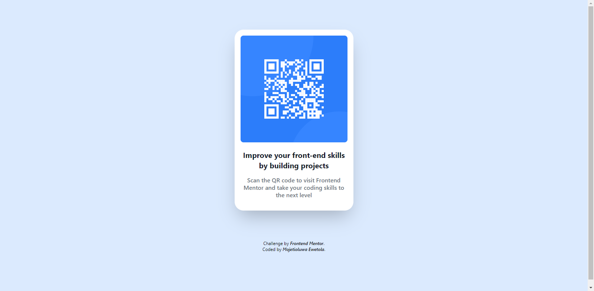

# Frontend Mentor - QR code component solution

This is a solution to the [QR code component challenge on Frontend Mentor](https://www.frontendmentor.io/challenges/qr-code-component-iux_sIO_H) using [Tailwind CSS](https://tailwindcss.com/). 

## Table of contents

- [Overview](#overview)
  - [Screenshot](#screenshot)
  - [Links](#links)
- [My process](#my-process)
  - [Built with](#built-with)
  - [What I learned](#what-i-learned)
  - [Continued development](#continued-development)
  - [Useful resources](#useful-resources)
- [Author](#author)


## Overview

### Screenshot



### Links

- Solution URL: [Add solution URL here](https://your-solution-url.com)
- Live Site URL: [Add live site URL here](https://your-live-site-url.com)

## My process

### Built with

- Semantic HTML5 markup
- [Tailwind CSS](https://tailwindcss.com/) - For styles

### What I learned

I learned how to use Tailwind CSS.

```css
.proud-of-this-css 
  @tailwind base;
  @tailwind components;
  @tailwind utilities;

```

### Continued development

I want to continue to learn Tailwind CSS and use it in future projects.

### Useful resources

- [Tailwind CSS: From Zero to Production](https://www.youtube.com/playlist?list=PL5f_mz_zU5eXWYDXHUDOLBE0scnuJofO0) - This helped me for styling and responsiveness. I really liked this pattern and will use it going forward.

- [Tailwind CSS DOCS](https://tailwindcss.com/docs/installation) - This is an amazing article which helped me understand Tailwind CSS. I'd recommend it to anyone still learning this concept.

## Author

- Website - [Add your name here](https://www.your-site.com)
- Frontend Mentor - [@yourusername](https://www.frontendmentor.io/profile/yourusername)
- Twitter - [@yourusername](https://www.twitter.com/yourusername)

